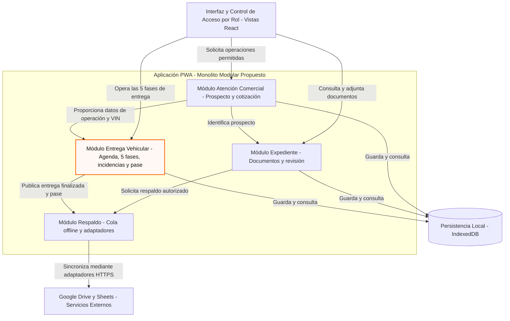

## 3. Diagrama de Componentes (Nivel 3 C4)

```mermaid
flowchart TD
    ui[Interfaz y Control de Acceso por Rol - Vistas React]

    subgraph app[Aplicación PWA - Monolito Modular Propuesto]
        comercial[Módulo Atención Comercial - Prospecto y cotización]
        expediente[Módulo Expediente - Documentos y revisión]
        entrega[Módulo Entrega Vehicular - Agenda, 5 fases, incidencias y pase]
        respaldo[Módulo Respaldo - Cola offline y adaptadores]
    end

    datos[(Persistencia Local - IndexedDB)]
    externos[Google Drive y Sheets - Servicios Externos]

    ui -->|Solicita operaciones permitidas| comercial
    ui -->|Consulta y adjunta documentos| expediente
    ui -->|Opera las 5 fases de entrega| entrega

    comercial -->|Identifica prospecto| expediente
    comercial -->|Proporciona datos de operación y VIN| entrega
    expediente -->|Solicita respaldo autorizado| respaldo
    entrega -->|Publica entrega finalizada y pase| respaldo

    comercial -->|Guarda y consulta| datos
    expediente -->|Guarda y consulta| datos
    entrega -->|Guarda y consulta| datos

    respaldo -->|Sincroniza mediante adaptadores HTTPS| externos

    style entrega fill:#fff8f4,stroke:#ff5d00,stroke-width:2px,color:#111111
```
