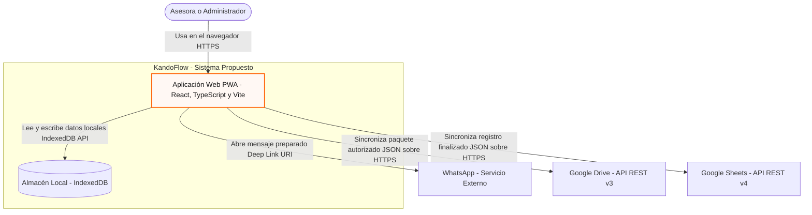

## 2. Diagrama de Contenedores (Nivel 2 C4)

```mermaid
flowchart TD
    usuario([Asesora o Administrador])

    subgraph kando[KandoFlow - Sistema Propuesto]
        app[Aplicación Web PWA - React, TypeScript y Vite]
        local[(Almacén Local - IndexedDB)]
    end

    wa[WhatsApp - Servicio Externo]
    drive[Google Drive - API REST v3]
    sheets[Google Sheets - API REST v4]

    usuario -->|Usa en el navegador HTTPS| app
    app -->|Lee y escribe datos locales IndexedDB API| local
    app -->|Abre mensaje preparado Deep Link URI| wa
    app -->|Sincroniza paquete autorizado JSON sobre HTTPS| drive
    app -->|Sincroniza registro finalizado JSON sobre HTTPS| sheets

    style app fill:#fff8f4,stroke:#ff5d00,stroke-width:2px,color:#111111
```
