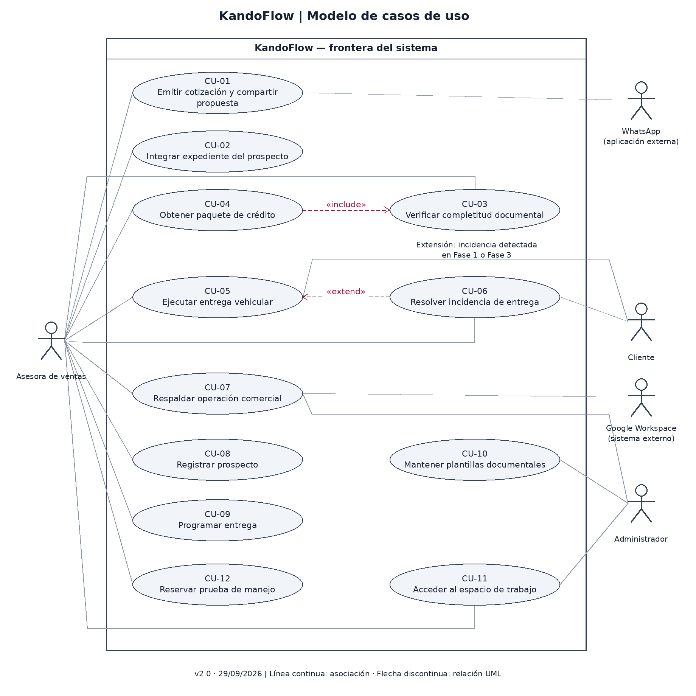

# Casos de uso — KandoFlow

**Versión:** 2.0 · **Fecha:** 29 de septiembre de 2026.

## 1. Frontera y actores

La frontera es la aplicación KandoFlow. La asesora y el administrador operan la aplicación; el cliente interviene únicamente en las confirmaciones del proceso de entrega y acuerdos mostrados en el dispositivo. Google Workspace y WhatsApp son sistemas externos. No se modelan IndexedDB, botones o tablas como actores.

- [Diagrama editable](diagramas/casos-de-uso.drawio)
- [Diagrama PNG](diagramas/casos-de-uso.png)

## 2. Catálogo y correspondencia

| CU | Objetivo del actor | Actores | RF |
|---|---|---|---|
| CU-01 | Emitir cotización y compartir propuesta | Asesora; WhatsApp | RF-01, RF-02 |
| CU-02 | Integrar expediente del prospecto | Asesora | RF-03, RF-13 |
| CU-03 | Verificar completitud documental | Asesora | RF-04 |
| CU-04 | Obtener paquete de crédito | Asesora | RF-05, RF-09 |
| CU-05 | Ejecutar entrega vehicular | Asesora; Cliente | RF-06, RF-12 |
| CU-06 | Resolver incidencia de entrega | Asesora; Cliente | RF-07 |
| CU-07 | Respaldar operación comercial | Asesora; Administrador; Google Workspace | RF-08, RF-17 |
| CU-08 | Registrar prospecto | Asesora | RF-10 |
| CU-09 | Programar entrega | Asesora | RF-11 |
| CU-10 | Mantener plantillas documentales | Administrador | RF-14 |
| CU-11 | Acceder al espacio de trabajo | Asesora; Administrador | RF-15 |
| CU-12 | Reservar prueba de manejo | Asesora | RF-16 |

**Relaciones UML:** CU-04 incluye CU-03: la verificación del expediente es obligatoria para generar un paquete. CU-06 extiende CU-05 cuando se detecta una incidencia en la inspección de Fase 1 o 3; no se ejecuta en toda entrega. Autenticación es precondición de las operaciones, no un `include` repetido en cada caso. Las asociaciones con actores no representan orden de ejecución.

## 3. Caso detallado CU-05 — Ejecutar entrega vehicular

| Campo | Especificación |
|---|---|
| Objetivo | Documentar la entrega completa y obtener un pase de salida únicamente cuando se satisfacen las validaciones |
| Actor principal | Asesora autenticada |
| Actor secundario | Cliente, para confirmación de recepción y acuerdos |
| Disparador | La asesora selecciona una entrega programada |
| Precondiciones | Sesión local desbloqueada; entrega y VIN disponibles; vehículo asignado; aplicación preparada si trabaja offline |
| Garantía mínima | Mantener el último avance confirmado y no emitir pase si falta un control o existe incidencia bloqueante |
| Postcondición de éxito | Cinco fases completas, pase único emitido, entrega Completada y registro disponible para respaldo |
| Postcondición de suspensión | Entrega Pausada, incidencia y fase de retorno conservadas, sin pase |
| Requisitos | RF-06, RF-07, RF-11, RF-12, RF-15; RNF-03, RNF-05, RNF-06, RNF-07, RNF-08 |
| Reglas | RN-03 y RN-04 |
| Pantallas previstas | SCR-07 a SCR-14; SCR-15 para respaldo posterior |
| Origen | H-04, H-07 y S-04; contenido del protocolo pendiente de validación de negocio |

### Controles propuestos por fase

| Fase | Controles obligatorios |
|---|---|
| 1 — Preparación/PDI | PDI reportada como concluida; revisión estética; documentos de entrega disponibles |
| 2 — Bienvenida y firma | Identidad del receptor cotejada; contratos y acta revisados/firmados según proceso de agencia |
| 3 — Develado e inspección | Inspección exterior e interior conjunta; accesorios cotejados |
| 4 — Orientación técnica | Posición de manejo; conectividad del teléfono; seguridad activa; explicación de MyMazda |
| 5 — Llaves y salida | Llaves y manuales entregados; recepción confirmada; autorización del pase |

Fotografía ceremonial y obsequio son opcionales. Si una función no equipa en el modelo, se registra «No aplica» con razón y referencia de versión del vehículo; no cuenta como omisión silenciosa. La configuración que exige red puede quedar pendiente y bloquea finalizar hasta resolverla; no se simula una activación externa sin conexión.

### Flujo principal

1. La asesora abre SCR-07 y selecciona la entrega; el sistema muestra prospecto, VIN, hora, bahía y estado.
2. La asesora comprueba que el VIN corresponde a la unidad e inicia. El sistema cambia Pendiente a En curso y abre SCR-08.
3. La asesora verifica los controles de Fase 1. El sistema registra cada confirmación con operador y hora; al completarlos habilita Fase 2.
4. En SCR-09 la asesora registra los controles de bienvenida y firma. El sistema habilita Fase 3 solo cuando todos están completos.
5. En SCR-10 la asesora realiza la inspección conjunta del vehículo y confirma accesorios. Si hay un detalle se activa FA-02; sin incidencias habilita Fase 4.
6. En SCR-11 la asesora registra orientación y configuración aplicable. El sistema habilita Fase 5 al completar los controles obligatorios.
7. En SCR-12 la asesora registra llaves y manuales; el cliente confirma la recepción en el dispositivo. El sistema revalida las fases anteriores y la ausencia de incidencias bloqueantes.
8. La asesora selecciona «Emitir pase». El sistema guarda el ID único, VIN, operador y hora UTC, muestra SCR-13 y marca Completada. Si falla el guardado se ejecuta FA-04.
9. El sistema deja la operación disponible en la cola de respaldo; si hay red se puede ejecutar CU-07. La falta de sincronización no invalida un pase ya guardado localmente.

### Flujos alternos y excepciones

**FA-01 — Control obligatorio pendiente (pasos 3, 4, 6 o 7).** El botón de avance permanece deshabilitado y aparece la lista textual de pendientes. La asesora atiende el control o deja la entrega En curso; no existe opción para omitirlo. Regresa al mismo paso después de resolverlo. Resultado: ningún pase mientras exista un pendiente.

**FA-02 — Daño o accesorio faltante (pasos 3 o 5; extensión CU-06).**

1. La asesora selecciona «Reportar incidencia»; el sistema abre SCR-14 y conserva fase/paso de retorno.
2. Registra área, descripción, tipo y fotografía disponible. Si no puede obtener fotografía, registra el motivo. El sistema guarda la incidencia y cambia a Pausada.
3. Si compromete seguridad, la entrega se mantiene bloqueada hasta que la asesora registre la resolución técnica y su evidencia. No se habilita una excepción por firma del cliente.
4. Para un detalle no crítico: puede registrar reparación terminada o un acuerdo de acondicionamiento con responsable, fecha y conformidad del cliente. Esta política S-04 requiere validación de agencia.
5. Si el cliente no acepta o falta información, permanece Pausada y vuelve al tablero. Si hay resolución/acuerdo válido y no existen otras incidencias bloqueantes, regresa a la fase original y exige completar sus controles restantes.

Postcondición: incidencia resuelta/acordada con historial o entrega suspendida sin pase. No se borran reportes al reanudar.

**FA-03 — Pérdida de conexión (cualquier paso).** El sistema muestra «Sin conexión», conserva cambios locales confirmados y permite continuar controles locales. Los servicios externos quedan pendientes. Si una configuración obligatoria necesita red, la asesora deja el control pendiente y no cierra la entrega hasta resolverlo; las fases ya confirmadas no se pierden.

**FA-04 — Falla de persistencia local (cualquier guardado, especialmente paso 8).** El sistema informa «No se pudo guardar» y conserva el estado previo confirmado. No muestra Completada ni pase nuevo. La asesora reintenta o deja la operación suspendida para recuperar almacenamiento; vuelve al mismo paso tras éxito. Un doble toque o reintento después de un guardado exitoso devuelve el mismo ID de pase.

**FA-05 — Sesión bloqueada (cualquier paso).** A los 15 minutos de inactividad se ocultan datos personales. Tras autenticación/desbloqueo válido se recupera la última fase guardada; un acceso fallido no revela el expediente ni pierde confirmaciones.

**FA-06 — VIN incorrecto (paso 2).** La asesora cancela el inicio, vuelve al tablero y selecciona/corrige la asignación correspondiente. No se trasladan confirmaciones de una unidad a otra.

### Escenarios para validar el prototipo

| Escenario | Entrada/acción | Resultado observable |
|---|---|---|
| V-01 Camino principal | Entrega ficticia sin incidentes, completar controles 1–5 | Pase en SCR-13 y estado Completada |
| V-02 Bloqueo | Intentar avanzar dejando un control de Fase 4 vacío | SCR-11 indica pendiente y no permite pase |
| V-03 Incidencia no crítica | En Fase 3 reportar accesorio faltante, guardar y acordar atención | Pausada; luego retorno a Fase 3 y continuación tras acuerdo completo |
| V-04 Incidencia bloqueante | Reportar daño de seguridad o rechazar acuerdo | Pausada, sin pase, retorno al tablero |
| V-05 Sin conexión | Activar estado simulado offline | Indicador visible y cola pendiente; no se afirma persistencia real |

Los resultados de navegación están pendientes de ejecutar en el Figma real. Los escenarios de rendimiento, seguridad y persistencia exigen pruebas futuras de implementación.
